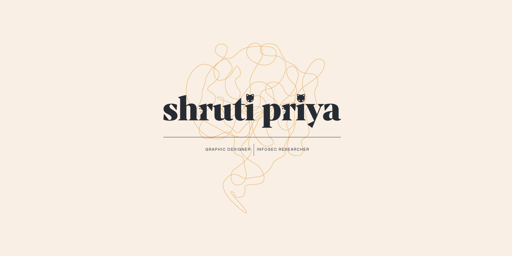

<h2>Hello!</h2>

- 👋 Hi, I’m @sapphicart.
- 👀 I’m interested in Cyber Security and Design.
- 🌱 I’m currently enrolled in MSc Cyber Security program at Royal Holloway, University of London.
- 👩🏻‍💻 Check out my [pentesting writeups](https://www.shrutipriya.in/writeups/writeups-introduction).
- 🔍 I also publish [OSINT + Cryptography challenges](https://www.shrutipriya.in/challenges/challenges-introduction).
- 📫 Reach me at [shrutipriya44@gmail.com](mailto:shrutipriya44@gmail.com).

<h2>Tech Stack</h2>

<h2>Design</h2>

    
    
    
    

<h2>Stats</h2>

    
    

<!---
sapphicart/sapphicart is a ✨ special ✨ repository because its `README.md` (this file) appears on your GitHub profile.
You can click the Preview link to take a look at your changes.
--->
