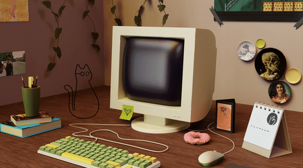

<h2>Hello, I'm Shruti Priya!</h2>

- 👀 I’m a Graphic Designer and InfoSec Researcher
- 🌱 I’m currently enrolled in MSc Cyber Security program at Royal Holloway, University of London
- 🦄 Take a look at my [design portfolio](https://www.behance.net/sapphicart)
- 👩🏻‍💻 Check out my [pentesting writeups](https://www.shrutipriya.com/writeups/)
- 🔍 I also publish [OSINT + Cryptography challenges](https://www.shrutipriya.com/challenges/)
- 📫 Reach me at [sp460@student.london.ac.uk](mailto:sp460@student.london.ac.uk)

 

<!---
sapphicart/sapphicart is a ✨ special ✨ repository because its `README.md` (this file) appears on your GitHub profile.
You can click the Preview link to take a look at your changes.
--->
